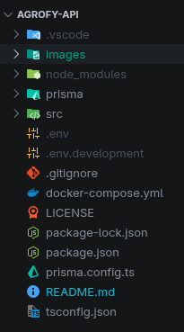

# 🚜 Agrofy API 🚀

Uma API robusta e escalável construída com Node.js e TypeScript para o ecossistema **Agrofy**.

---

## 🧐 Sobre o Projeto

A **Agrofy API** é o coração da nossa plataforma, fornecendo endpoints eficientes para o gerenciamento de usuários e integração de dados agrícolas. Desenvolvida seguindo os princípios de Clean Architecture e SOLID para garantir manutenibilidade e performance.

---

## 🛠️ Tecnologias Utilizadas

Este projeto utiliza o que há de mais moderno no ecossistema JavaScript:

*   **[Node.js](https://nodejs.org/)** - Ambiente de execução JavaScript.
*   **[TypeScript](https://www.typescriptlang.org/)** - Tipagem estática para maior segurança.
*   **[Express 5](https://expressjs.com/)** - Framework web rápido e minimalista.
*   **[Helmet](https://helmetjs.github.io/)** - Segurança reforçada através de headers HTTP.
*   **[Morgan](https://github.com/expressjs/morgan)** - Logger de requisições HTTP.
*   **[Cors](https://github.com/expressjs/cors)** - Configuração de segurança para acesso cross-origin.

---

## 📋 Pré-requisitos

Antes de começar, você vai precisar ter instalado em sua máquina:

### Obrigatório

*   [Node.js](https://nodejs.org/en/) (v18 ou superior recomendado)
*   NPM (Node Package Manager). Obs: O NPM é instalado junto com o NodeJS de forma automática.

### Opcional (Altamente recomendado)

Para conseguir iniciar o servidor de banco de dados PostgreSQL localmente de forma fácil e rápida e se conectar com a aplicação de forma facilitada, instale o Docker:

*   [Docker Desktop](https://docs.docker.com/desktop/setup/install/windows-install/)

---

## 📝 Preparativos

### Obrigatório

#### 1. Instale o [Node.js](https://nodejs.org/en/) no link:
[https://nodejs.org/en/](https://nodejs.org/en/)

#### 2. Após instalar o [Node.js](https://nodejs.org/en/), instale o compilador do typescript através do comando:
```bash
npm install -g typescript
```

### Opcional (Altamente recomendado)

#### 1. Instale o [Docker Desktop](https://docs.docker.com/desktop/setup/install/windows-install/) no link: 
[https://docs.docker.com/desktop/setup/install/windows-install/](https://docs.docker.com/desktop/setup/install/windows-install/)

---

## 🚀 Como Rodar a Aplicação

Siga o passo a passo abaixo para colocar a API no ar:

### 1. Clonar o repositório
```bash
git clone https://github.com/seu-usuario/agrofy-api.git
cd agrofy-api
```

### 2. Instalar dependências
```bash
npm install
```

### 3. Acesse o drive da turma e faça o download das variáveis de ambiente (".env" e ".env.development").
 Essas variáveis carregam dados de acesso confidenciais, que não devem ser expostos em qualquer lugar ou armazenados em computadores públicos.

### 4. Copie e cole essas variáveis de ambiente para dentro da raíz do projeto agrofy-api, como demonstra a imagem abaixo:



### 5. Próxima Etapa: Formas para rodar a aplicação

### A. Produção

#### 1. Para rodar a aplicação em produção, basta executar os seguintes comandos:

```bash
npx prisma generate
```

```bash
npm run prod
```

### B. Desenvolvimento

#### 1. Vá para a branch "develop" com o comando:

```bash
git checkout develop
```

#### 2. Para rodar a aplicação em desenvolvimento é necessário ter um servidor de banco de dados PostgreSQL rodando. Para isso, após ter instalado o [Docker Desktop](https://docs.docker.com/desktop/setup/install/windows-install/), basta executar o seguinte comando:

```bash
docker-compose up
```

Obs: Esse comando sobe o container listado no arquivo "docker-compose.yml", criando o servidor de banco de dados com as informações de acesso exatas listadas no arquivo ".env.development", tornando a conexão da aplicação com o banco de dados simples e direta.

#### 3. Em seguida, com o servidor de banco de dados PostgreSQL rodando, execute o comando para gerar o prisma client:

```bash
npm run prisma:generate
```

#### 4. Em seguida, com o servidor de banco de dados PostgreSQL rodando, execute o comando para criar as tabelas:

```bash
npm run migrate:dev
```

#### 5. Para adicionar os dados de teste no banco de dados, execute o comando abaixo:

```bash
npm run seed:dev
```

#### 6. Agora, para rodar a aplicação, execute o comando:

```bash
npm run dev
```

---

## 🛣️ Endpoints Principais

| Método | Endpoint | Descrição |
| :--- | :--- | :--- |
| `GET` | `/users/:id` | Retorna os detalhes de um usuário específico |

---

## 📂 Estrutura de Pastas

```text
images/             # Imagens utilizadas pelo README.md
prisma/             # Armazena algumas informações do ORM Prisma, que acessa o banco de dados
src/                # Armazena o código da aplicação
├── controllers/    # Lógica de controle das rotas
├── lib/            # Arquivos compartilháveis pela aplicação
├── models/         # Definições de dados (Interfaces/Types)
├── repositories/   # Acesso a dados e persistência
├── routers/        # Definição das rotas da API
├── app.ts          # Configuração do Express
└── server.ts       # Inicialização do servidor
docker-compose.yml  # Código para inicialização de containers Docker
LICENSE             # Controla a licença do aplicativo
package.lock.json   # Armazena dependências do projeto
package.json        # Armazena dependências e configurações do projeto
prisma.config.ts    # Armazena a configuração do Prisma ORM
README.md           # Essa documentação
tsconfig.json       # Armazena as configurações do Typescript na aplicação
```

---

## 🤝 Contribuição

1. Faça um **Fork** do projeto.
2. Crie uma nova **Branch** com sua feature (`git checkout -b feature/MinhaFeature`).
3. Faça **Commit** das suas alterações (`git commit -m 'Adicionando nova feature'`).
4. Faça **Push** para a Branch (`git push origin feature/MinhaFeature`).
5. Abra um **Pull Request**.

---

## 📄 Licença

Este projeto está sob a licença **ISC**.

---

<p align="center">
  Feito com ❤️ pela equipe Agrofy 🌿
</p>
